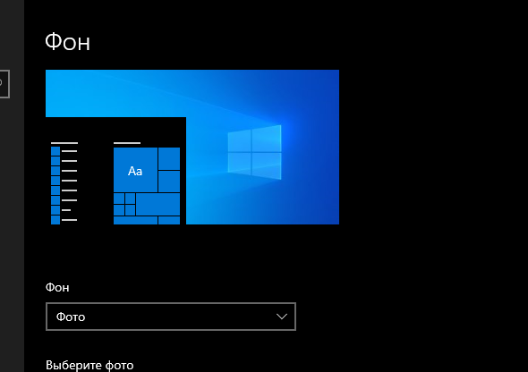
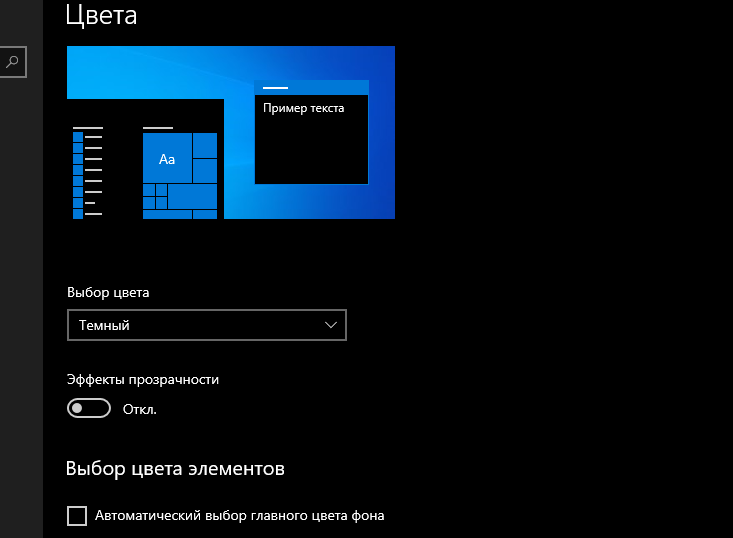
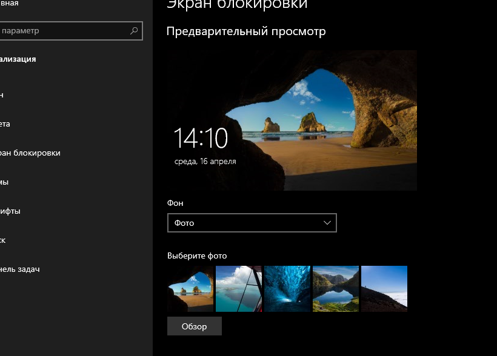
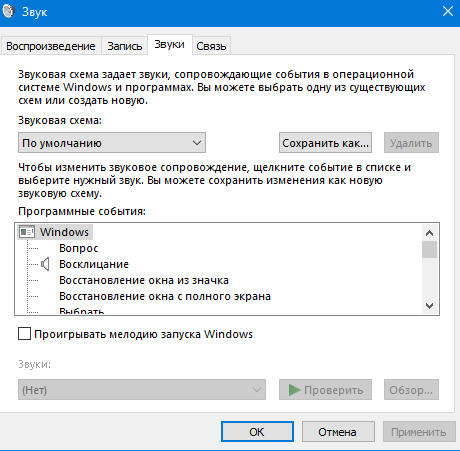
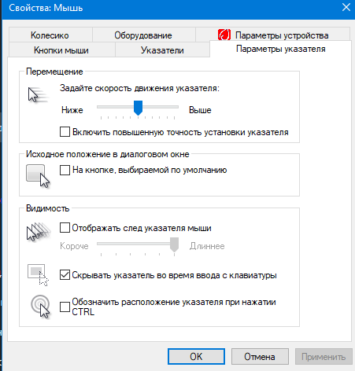
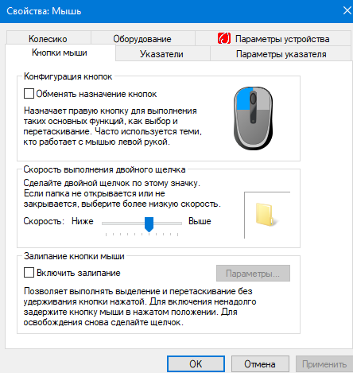
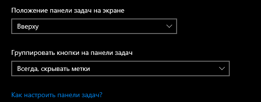
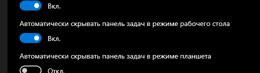
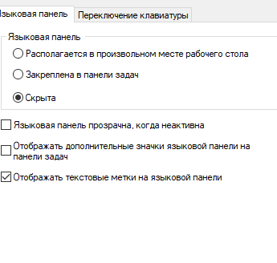
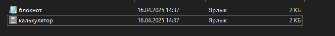

# Лабораторная работа №1  
## Настройка параметров рабочей среды пользователя в ОС Windows  

**Цель:** Научиться выполнять различные настройки параметров рабочей среды пользователя.  

---

### **I. Настройка рабочего стола**  
1. **Фоновый рисунок**  
   - ПКМ на рабочем столе → Персонализация → Фон  
   
   - Выбрать: изображение/слайд-шоу/сплошной цвет  

2. **Цветовая схема**  
   - Персонализация → Цвета → Выбор акцентного цвета  

3. **Заставка**  
   - Персонализация → Экран блокировки → Параметры заставки  
   - Установить время бездействия  

4. **Сохранение темы**  
   - Темы → Сохранить текущую тему  
   - Папка: `C:\Users\[User]\AppData\Local\Microsoft\Windows\Themes`  

---

### **II. Настройка звуков**  
1. **Звуковая схема**  
   - Панель управления → Звук → Вкладка "Звуки"  
   - Выбрать схему (например, "Упрощенная")  

2. **Сохранение схемы**  
   - "Сохранить как..." → Ввести имя  
   - Папка: `C:\Windows\Media`  

---

### **III. Настройка мыши**  
| Параметр               | Действие |
|------------------------|----------|
| Скорость двойного щелчка | Мышь → Кнопки → Регулировка ползунка |
| Схема указателей       | Мышь → Указатели → Выбор схемы |
| След указателя         | Параметры указателя → Включить "Отображать след" |
| Прокрутка колесика     | 7 строк за щелчок |


---

### **IV. Настройка панели задач**  
```bash
1. Положение: Верх экрана
2. Автоскрытие: Вкл
3. Группировка: При заполнении
4. Значки: Скрыть громкость/сеть
5. Закрепить: Paint




### **VII. Настройка клавиатуры**
Языковая панель:
Панель управления → Язык → Доп. параметры → Скрыть/показать


###**V. Главное меню**

Добавить ярлыки:

Калькулятор (calc.exe)

Блокнот (notepad.exe)
